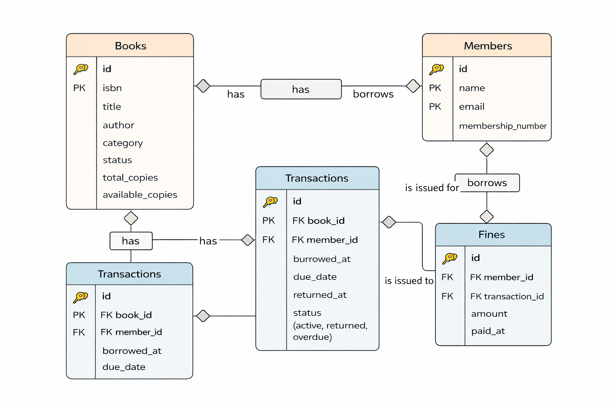

# 📚 Library Management System API

A complete RESTful Library Management System API built using **Node.js, Express.js, and MySQL**.  
This project focuses on **business logic enforcement**, **state machine implementation**, and **real-world backend workflows** such as borrowing limits, overdue handling, fines, and member suspension.

---

## 🎯 Project Objective

The objective of this project is to design and implement a backend API that manages:

- Books
- Members
- Borrowing transactions
- Overdue fines

The system strictly enforces business rules such as:

- Borrowing limits
- Overdue penalties
- Book availability states
- Member suspension logic

---

## 🛠️ Technology Stack

- **Backend:** Node.js, Express.js
- **Database:** MySQL
- **API Testing:** Postman
- **Language:** JavaScript (ES Modules)

---

## 🗄️ Database Schema

### 📘 Books Table

- `id`
- `isbn`
- `title`
- `author`
- `category`
- `status` (`available`, `borrowed`, `reserved`, `maintenance`)
- `total_copies`
- `available_copies`

### 👤 Members Table

- `id`
- `name`
- `email`
- `membership_number`
- `status` (`active`, `suspended`)

### 🔁 Transactions Table

- `id`
- `book_id` (Foreign Key)
- `member_id` (Foreign Key)
- `borrowed_at`
- `due_date`
- `returned_at`
- `status` (`active`, `returned`, `overdue`)

### 💰 Fines Table

- `id`
- `member_id` (Foreign Key)
- `transaction_id` (Foreign Key)
- `amount`
- `paid_at`

---

## 🔄 State Machine Implementation

### 📘 Book State Machine

- A book can only be borrowed if it is in `available` state.
- Returning a book moves it back to `available`.

### 🔁 Transaction State Machine

- If returned after the due date, the transaction becomes `overdue`.
- Overdue return triggers fine creation.

### 👤 Member State Machine

- A member is automatically suspended if they have **3 or more overdue books**.

---

## 📜 Business Rules Enforced

- A member can borrow **a maximum of 3 books** at a time.
- Standard loan period is **14 days**.
- Overdue fine is **$0.50 per day**.
- Members with **unpaid fines cannot borrow books**.
- Members with **3 or more overdue transactions are suspended**.
- Borrowing updates:
  - Book availability
  - Transaction records
- Returning an overdue book automatically creates a fine.

---

## 🔗 API Documentation

### 📘 Books APIs

| Method | Endpoint           | Description         |
| ------ | ------------------ | ------------------- |
| POST   | `/books`           | Add a new book      |
| GET    | `/books`           | Get all books       |
| GET    | `/books/available` | Get available books |
| GET    | `/books/:id`       | Get book by ID      |
| PUT    | `/books/:id`       | Update book         |
| DELETE | `/books/:id`       | Delete book         |

### 👤 Members APIs

| Method | Endpoint                | Description                  |
| ------ | ----------------------- | ---------------------------- |
| POST   | `/members`              | Add member                   |
| GET    | `/members`              | Get all members              |
| GET    | `/members/:id`          | Get member by ID             |
| GET    | `/members/:id/borrowed` | Get borrowed books by member |

### 🔁 Transactions APIs

| Method | Endpoint                   | Description               |
| ------ | -------------------------- | ------------------------- |
| POST   | `/transactions/borrow`     | Borrow a book             |
| POST   | `/transactions/:id/return` | Return a book             |
| GET    | `/transactions/overdue`    | List overdue transactions |

### 💰 Fines APIs

| Method | Endpoint         | Description |
| ------ | ---------------- | ----------- |
| POST   | `/fines/:id/pay` | Pay a fine  |

---

## 🧪 API Testing (Postman)

A complete Postman collection is included in this repository:

### Steps to Test:

1. Open Postman
2. Click **Import**
3. Import the collection JSON file
4. Execute requests in order:
   - Add Book
   - Add Member
   - Borrow Book
   - Return Book
   - Pay Fine

---

## ⚙️ Setup Instructions

### 1️⃣ Clone the Repository


git clone https://github.com/Vidyasri17/Library-Management-API
cd library-management-api

### 2️⃣ Install Dependencies
npm install

### 3️⃣ Configure Environment Variables

Create a .env file:

DB_HOST=localhost
DB_USER=root
DB_PASSWORD=your_password
DB_NAME=library_db
PORT=5000

### 4️⃣ Create Database Tables

Create the required tables in MySQL using the schema described above.

### 5️⃣ Start the Server
npm start


Server will run at:

http://localhost:5000
```

## 🧩 ER Diagram

The following ER diagram represents the relationships between Books, Members, Transactions, and Fines.



## 📸 API Testing Screenshots

### ➕ Add Book


### ➕ Add Member


### 📚 Get All Books


### 📚 Get Available Books


### 👤 Get All Members


### 🔄 Borrow Book


### 🔁 Return Book


### 💰 Pay Fine


